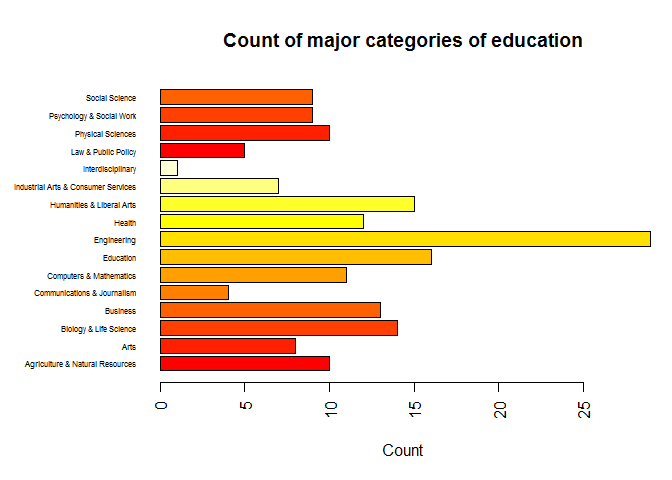

## R Markdown

# Install fivethirtyeight package


```r
##install.packages("fivethirtyeight")

library(fivethirtyeight)
```

```
## Warning: package 'fivethirtyeight' was built under R version 3.4.4
```

## 1.	FiveThirtyEight Data (30 points): Navigate on GitHub to https://github.com/rudeboybert/fivethirtyeight and read README.md. Seriously, it will include everything you need.  
## a.	Install the fivethirtyeight package.  
## b.	In the listing of Data sets in package 'fivethirtyeight,' assign the eighteenth data set to an object 'df.'  
## c.	Use a more detailed list of the data sets to write out the URL in a comment to the related news story.  
## d.	Using R command(s), give the dimensions and column names of this data frame.  


```r
data("college_all_ages")

df <- college_all_ages

dim(df)
```

```
## [1] 173  11
```

```r
names(df)
```

```
##  [1] "major_code"                  "major"                      
##  [3] "major_category"              "total"                      
##  [5] "employed"                    "employed_fulltime_yearround"
##  [7] "unemployed"                  "unemployment_rate"          
##  [9] "p25th"                       "median"                     
## [11] "p75th"
```

## a.	Write an R command that gives you the column names of the data frame.  Right after that, write one that counts the number of columns but not rows.  Hint: The number should match one of your numbers in Question 1d for dimensions.  
## b.	Generate a count of each unique major_category in the data frame.  I recommend using libraries to help.  I have demonstrated one briefly in live-session.  To be clear, this should look like a matrix or data frame containing the major_category and the frequency it occurs in the dataset.  Assign it to major_count.  

## c.	To make things easier to read, put par(las=2) before your plot to make the text perpendicular to the axis.  Make a barplot of major_count.  Make sure to label the title with something informative (check the vignette if you need), label the x and y axis, and make it any color other than grey.  Assign the major_category labels to their respective bar.  Flip the barplot horizontally so that bars extend to the right, not upward.  All of these options can be done in a single pass of barplot(). Note: It's okay if it's wider than the preview pane.  

## d.	Write the fivethirtyeight data to a csv file.  Make sure that it does not have row labels.  


```r
names(college_all_ages)
```

```
##  [1] "major_code"                  "major"                      
##  [3] "major_category"              "total"                      
##  [5] "employed"                    "employed_fulltime_yearround"
##  [7] "unemployed"                  "unemployment_rate"          
##  [9] "p25th"                       "median"                     
## [11] "p75th"
```

```r
length(names(college_all_ages))
```

```
## [1] 11
```

```r
unique(college_all_ages$major_category)
```

```
##  [1] "Agriculture & Natural Resources"    
##  [2] "Biology & Life Science"             
##  [3] "Engineering"                        
##  [4] "Humanities & Liberal Arts"          
##  [5] "Communications & Journalism"        
##  [6] "Computers & Mathematics"            
##  [7] "Industrial Arts & Consumer Services"
##  [8] "Education"                          
##  [9] "Law & Public Policy"                
## [10] "Interdisciplinary"                  
## [11] "Health"                             
## [12] "Social Science"                     
## [13] "Physical Sciences"                  
## [14] "Psychology & Social Work"           
## [15] "Arts"                               
## [16] "Business"
```

```r
major_count <- with(df, table(college_all_ages$major_category))

par(mar=c(5,8,4,1)+.1)

barplot(major_count,
main = "Count of major categories of education",
xlab = "Count",
names.arg = c(rownames(major_count)),
col = heat.colors(12), angle=90,
horiz = TRUE,  axes=TRUE, cex.names=0.5, las=2)
```

<!-- -->

## Including Plots

## d.	Write the fivethirtyeight data to a csv file.  Make sure that it does not have row labels.  


```r
write.csv(college_all_ages,file="college_all_ages.csv", row.names=FALSE)
```
